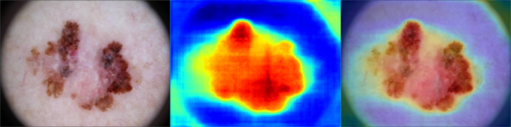

# Just a U-Net

This repository contains an implementation of a classic U-NET architecture, which is widely used for image segmentation tasks. The U-NET model is known for its ability to produce high-quality segmentation maps even with a limited amount of training data.

## Reference
For more details on the U-NET architecture, please refer to the original paper: 
Ronneberger, O., Fischer, P., & Brox, T. (2015). U-Net: Convolutional Networks for Biomedical Image Segmentation [<a href="https://doi.org/10.48550/arXiv.1505.04597">arXiv:1505.04597</a>]

## Example
After training on the HAM10000 skin injury segmentation dataset, which includes expert-drawn segmentation mask annotations, the U-Net demonstrates some capability to predict skin injury segmentations in dermatoscopic images.  

  
   
  <em> Melanoma and U-Net prediction mask. Original image (left), prediction (center), superposition (right). Source for the original image <a href="https://gallery.isic-archive.com/">ISIC Archive (Unique ID: ISIC_0000031)</a>. Original image published under Creative Commons CC-0 copyright license.
  </em>

 

## Further details
It includes Dataset classes for loading data from: 
* [VOC2012](http://host.robots.ox.ac.uk/pascal/VOC/): A classic 1000 everyday object categories semantic segmentation dataset. 
* [HAM10000](https://dataverse.harvard.edu/dataset.xhtml?persistentId=doi:10.7910/DVN/DBW86T): A skin injury segmentation dataset. 